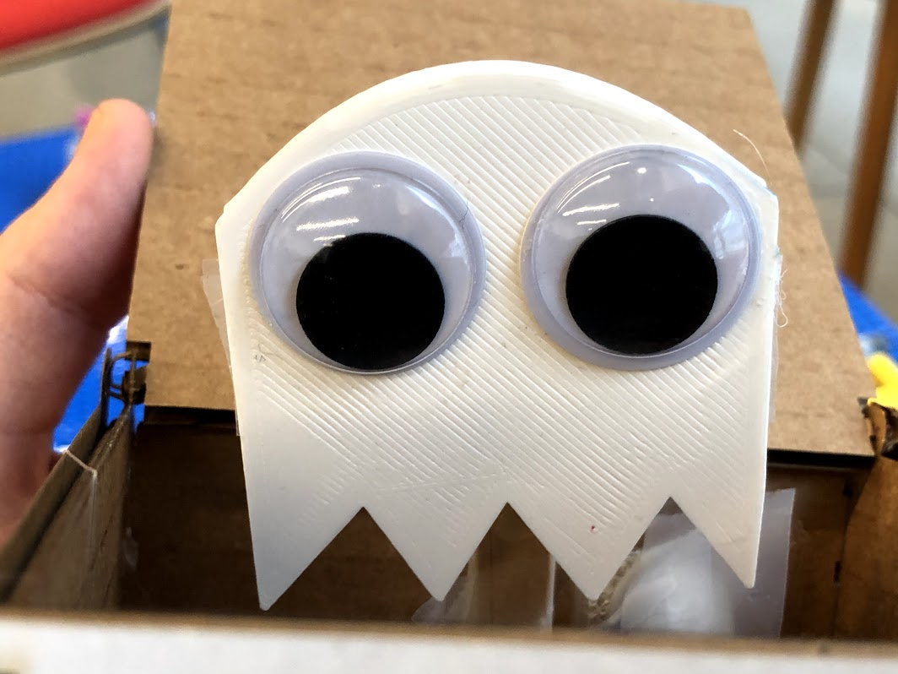
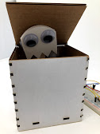

# Jack in the Box


## Laser Cutting

**a. Include a photo of your box here.**
**b. Include `.stl` files.**

[box design](https://github.com/FAR-Lab/Developing-and-Designing-Interactive-Devices/blob/2019Fall/Lab5/boxTall.pdf)


## 3D Printing

**a. Include a photo of your printed part here.**



**b. Include `.stl` or `.svg` files if you made modifications.**

[Pac Man Ghost stl file](https://github.com/drywitte/IDD-Fa19-Lab5/blob/master/Dan%20Witte%20Lab%205.stl)

## Electronics

**a. Upload code & a photo of your electronic circuit here.**


## Putting it All Together

Include here:
1. Your Arduino code.

```
// If we see a voltage change on pin 2 the toggle switch on top of the useless box has 
// changed position and we need to react!
//    A HIGH value on pin 2 means we should activate the servo to open the useless 
//    box and attempt to return the switch to the "off" position.
//    A LOW value on pin 2 means the switch is off and we should return to our 
//    inital (closed box) state.

#include <Servo.h> 

#define servoPin  10
#define switchPin 2

#define closePos  10
#define openPos   110

Servo servo;
int switchState;
int previousSwitchState;

// call this when the input on pin 2 changes (LOW to HIGH *or* HIGH to LOW)
void ToggleSwitch(int switchState)
{    
  if (switchState == HIGH)
  {
    servo.write(openPos);
    //Serial.println("switch state is HIGH.  servo.write(openPos) called to open useless box");
  }
  else
  {
    servo.write(closePos);
    //Serial.println("switch state is LOW.   servo.write(closePos) called to close useless box");
  }
  previousSwitchState = switchState;  // remember that the switch state has changed 
}

void setup()
{
  //Serial.begin(9600);
  //Serial.println("Useless Box Lab 5");
  pinMode(5,OUTPUT);
  digitalWrite(5,HIGH);
  // start with the box closed and the switch in the off postion
  switchState = LOW;
  previousSwitchState = LOW;

  // connect to our servo and make sure it is in the closed position
  servo.attach(servoPin);
  servo.write(closePos);

  // we should probably pay attention to the switch
  pinMode(switchPin, INPUT); 
}

void loop()
{ 
  int switchState = digitalRead(switchPin);
  if (switchState != previousSwitchState)
    ToggleSwitch(switchState);

  delay(20);
}
```

2. At least one photo of your Jack in the Box taken in the MakerLab's Portable Photo Studio (or somewhere else, but of similar quality).



3. A video of your Jack in the Box in action.

[Video of box in action](https://photos.app.goo.gl/PBeJLJ5L1eHPhXm38)
